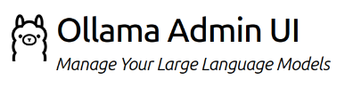
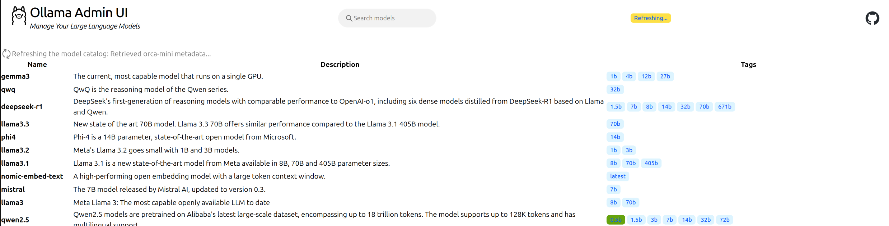
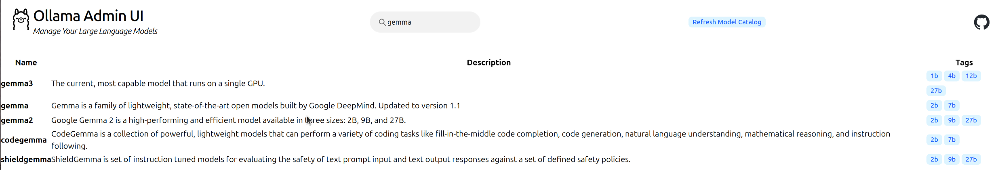
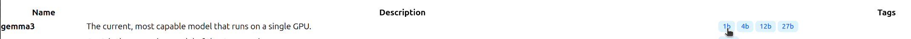
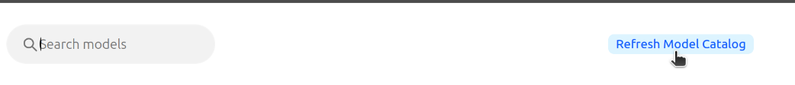

# ollama-admin-ui



## "Manage Your Large Language Models"


> DISCLAIMER: I am not affiliated with the [Ollama](https://ollama.com) project. I made this for fun.

> DISCLAIMER: ollama-admin-ui provides no authentication mechanisms and makes no guarantees about security. You probably shouldn't use it in production.

ollama-admin-ui is a web application that makes it easy to administer your local ollama docker installation.

Specifically, ollama-admin-ui makes it easy to...

- see what models are available for download
- search model names, descriptions, and tags
- download desired models
- remove unwanted models

Further, ollama-admin-ui...

- provides links back to ollama.com for individual models, making it easy to get additional information from the official source.
- uses the same visual styling engine (Tailwindcss) and themes that ollama.com uses, making ollama-admin-ui visually appealing and coherent. Switching between ollama.com and ollama-admin-ui is seamless.
- provides an exportable ollama model/tag library manifest in json.

## Motivation

- I wanted something to help me manage the models on my local ollama installation without having to run curl commands or a python script and I wasn't aware of a similar project.
- I recently read the [hypermedia systems](https://hypermedia.systems/) book, and was inspired to make a hypermedia-based web application.

# Usage

```
cd ollama-admin-ui
docker compose up
```

Access at <http://localhost:8001/>

## Search


Use the search box to search for models and tags.
>Tip: search for "downloaded" to see which models/tags are already downloaded.
>
## Download/Delete



- Hover over the model tag and click the desired tag.
- Once the model is finished downloading, it will turn green.
- Click a green model tag to be prompted to delete the downloaded model.

## Get more information

- Click the model name to be taken to the model page at ollama.com

## Update the model/tag catalog



- click the "Refresh Model Catalog" button to refresh the list of models and tags with information from ollama.com

## Accessing the model/tag catalog programmatically

If you're a developer, the utility class wollama, provided by ollama-admin-ui source code can be used to produce the ollama model/tag library as JSON.

```

from wollama.wollama import (
    Catalog,
    ModelTag,
    ModelTagCollection,
    OllamaInfo,
    OllamaRegistry,
)

# Initialize the OllamaRegistry client to read the remote ollama library

oregistry = OllamaRegistry()

# The OllamaRegistry should already have a version of the model/tag catalog cached.
if oregistry:
    try:
        oregistry.load_from_cache()
    except Exception as e:
        print(f"Could not load oregistry catalog from cache...:\n{e}")
        try:
            oregistry.refresh()
        except:
            print("Could not refresh the remote catalog from the web!")

catalog = oregistry.catalog

# Write the catalog to a JSON

catalog.export_catalog("/path/to/file.json")

```

## Limitations

- It is a known issue that ollama does not publish a complete manifest of model and tag information for easy download.
  - <https://github.com/ollama/ollama/issues/286>
  - <https://github.com/ollama/ollama/pull/10174>
  - <https://github.com/ollama/ollama/pull/10046>
- As a result, ollama-admin-ui must scrape ollama.com for model information to refresh the library. To mitigate overloading of the servers, ollama-admin-ui comes with a library that is preloaded with information.
- The refresh functionality is rate-limited to protect ollama.com's servers, making a complete library refresh slow. As the ollama team publishes a way to pull library information without web-scrapping, this part of the application can be updated to use that method instead.

# Similar Projects

- <https://github.com/lemonit-eric-mao/ollama-web-management>
- <https://github.com/imoize/plasmoid-ollamacontrol>

# Contributing

## Prerequisites

- [uv](https://docs.astral.sh/uv/)
- [tailwindcss cli](https://tailwindcss.com/docs/installation/tailwind-cli)

## Install Dependencies

```

uv sync

```

## Run

```

uv run main.py

```

## Styling

- Use Tailwindcss utility classes in html.
- Generate new css using tailwindcss cli.

```

tailwindcss --watch -i ./app/static/css/input.css -o ./app/static/css/output.css

```

- Use icons from [heroicons](https://heroicons.com/)

## About

- [Hypermedia, HTMX, Hyperscript](https://hypermedia.systems/extending-html-as-hypermedia/>)
- [FastAPI](https://fastapi.tiangolo.com/)
- [Jinja](https://jinja.palletsprojects.com/en/stable/)
- [pyproject.toml](https://packaging.python.org/en/latest/guides/writing-pyproject-toml/)
- [uv](https://docs.astral.sh/uv/guides/integration/docker/)
